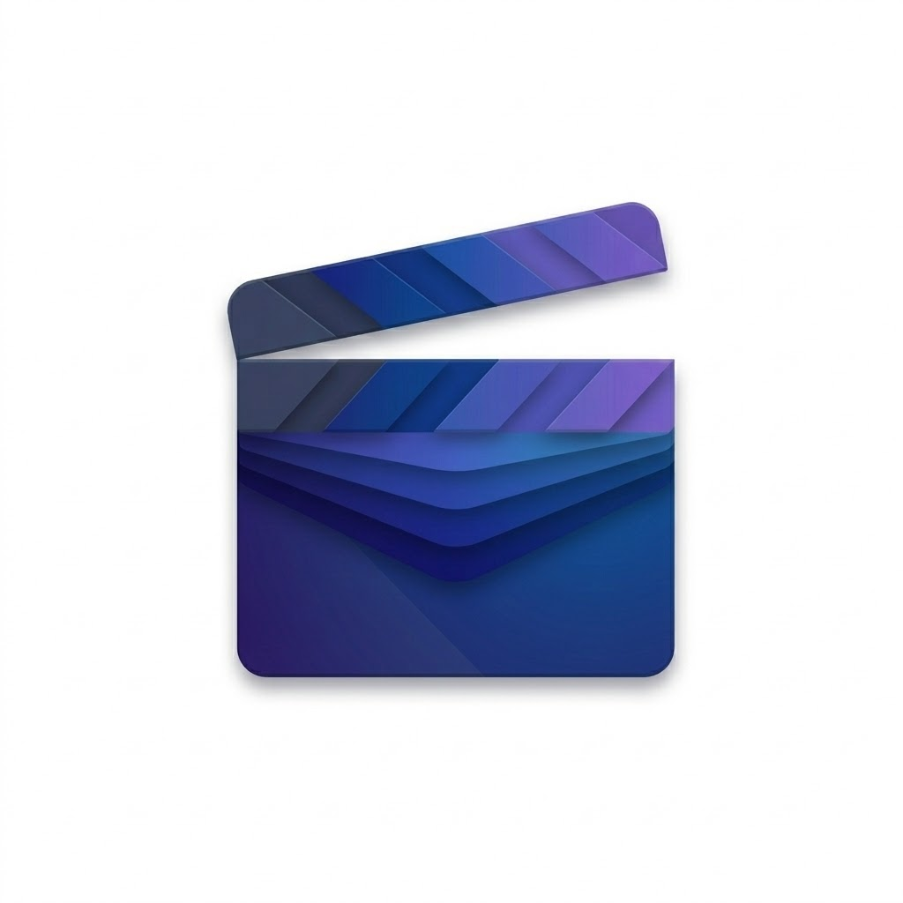

#  CineStack

[English](#english) | [Español](#español)

---

## English

**CineStack** is a modern Android application built with **Jetpack Compose** that allows users to explore the movie world using the TMDB API. From trailers and cast details to user reviews and streaming availability.

  
  

### ✨ Key Features (v1.1)
* 🔍 **Smart Search:** Real-time movie search with optimized pagination.
* ✍️ **User Reviews:** Read community feedback from TMDB (expandable UI).
* 📺 **Streaming Check:** Verify which platforms (Netflix, Disney+, etc.) have the movie in Argentina.
* 🎭 **Cast & Crew:** Detailed information about the main cast with photos.
* ❤️ **Favorites:** Persistent local storage via offline database.
* 🌓 **Dynamic Theme:** Full support for Light and Dark modes.

### 🛠️ Tech Stack
* **Language:** Kotlin + Coroutines & Flow.
* **UI:** Jetpack Compose (Material Design 3).
* **Architecture:** MVVM + Repository Pattern.
* **Networking:** Retrofit & OkHttp.
* **Database:** Room (Favorites) & DataStore (Preferences).

---

## Español

**CineStack** es una aplicación de Android moderna construida con **Jetpack Compose** que permite a los usuarios explorar el mundo del cine utilizando la API de TMDB. Desde trailers y reparto hasta reseñas de usuarios y disponibilidad de streaming.

### ✨ Características (v1.1)
* 🔍 **Búsqueda Avanzada:** Encontrá películas en tiempo real con paginación optimizada.
* ✍️ **Reseñas de Usuarios:** Leé las críticas de la comunidad (interfaz expandible).
* 📺 **Streaming Check:** Consultá en qué plataformas está disponible cada película en Argentina.
* 🎭 **Cast & Crew:** Información detallada del reparto principal con fotos.
* ❤️ **Favoritos:** Guardado local persistente mediante base de datos offline.
* 🌓 **Modo Dinámico:** Soporte total para temas claro y oscuro.

---

### 📦 Installation / Instalación
You can download the latest APK from the releases section / Podés descargar el último APK desde la sección de releases:
👉 [**Download CineStack v1.1**](https://github.com/gcendon91/CineStack/releases/tag/v1.1.0)

---
*Developed by Gonzalo Cendón - 2026*