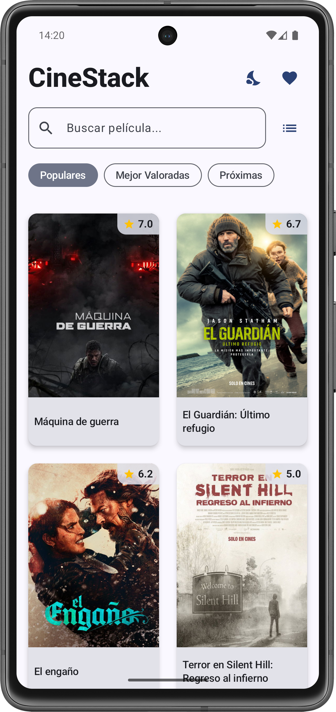
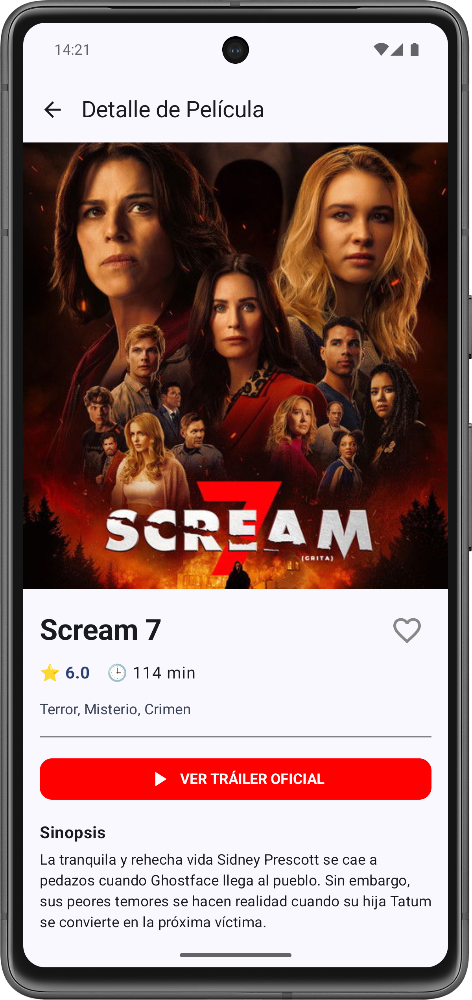

# 🎬 CineStack

Explorador de películas utilizando la API de TMDB. Una implementación funcional y robusta para practicar arquitectura y componentes modernos en Android.

### 🌟 Características principales:
* 🔍 **Buscador Inteligente:** Búsqueda con scroll infinito en tiempo real y actualización dinámica de la grilla.
* ♾️ **Paginación Global:** Implementación de scroll infinito en categorías, filtros por género y resultados de búsqueda para una exploración sin interrupciones.
* 📺 **Watch Providers (AR):** Visualización de plataformas de streaming disponibles específicamente en Argentina (Netflix, Disney+, Max, etc.) para cada título.
* 🌓 **Persistencia de Tema:** Soporte para Modo Oscuro/Claro que persiste entre sesiones mediante Jetpack DataStore.
* 🎭 **Ficha Técnica Completa:** Información detallada incluyendo director, elenco principal, duración, géneros y sugerencias de películas similares.
* ⭐ **Favoritos:** Sistema de guardado local para gestionar películas preferidas de forma offline.
* 🏗️ **Arquitectura:** Separación clara de responsabilidades mediante los patrones **MVVM** (Model-View-ViewModel) y **Repositorio**.

---

# 🎬 CineStack (English)

Movie explorer using the TMDB API. A functional and robust implementation for practicing modern Android components and architecture.

### 🌟 Key Features:
* 🔍 **Smart Search:** Instant search with infinite scroll and dynamic grid updates.
* ♾️ **Global Pagination:** Infinite scrolling implemented across categories, genre filters, and search results for seamless exploration.
* 📺 **Watch Providers (AR):** Integration of streaming platforms available specifically in Argentina (Netflix, Disney+, Max, etc.).
* 🌓 **Theme Persistence:** Dark/Light mode support that persists across sessions using Jetpack DataStore.
* 🎭 **Full Movie Info:** Detailed view including director, main cast, runtime, genres, and similar movie recommendations.
* ⭐ **Favorites:** Local storage system to manage favorite movies offline.
* 🏗️ **Architecture:** Clean layer separation using **MVVM** (Model-View-ViewModel) and **Repository** patterns.

---

### 🛠️ Stack Tecnológico / Tech Stack:

**🇦🇷 Español**
* **Kotlin + Coroutines:** Manejo de hilos y asincronismo para el consumo de datos sin bloquear la interfaz.
* **Jetpack Compose:** UI declarativa nativa para una interfaz moderna y fluida.
* **Retrofit:** Cliente para el consumo de la API REST de *The Movie Database* (TMDB).
* **Jetpack DataStore:** Almacenamiento persistente de preferencias de usuario (Tema) de forma asíncrona.
* **Room Database:** Persistencia local para la gestión de la base de datos de películas favoritas.
* **Coil:** Librería para la carga asíncrona y eficiente de imágenes (pósters y logos de plataformas).
* **ViewModel & State Management:** Gestión de estados de pantalla mediante `StateFlow` (Loading, Success, Error).

**🇺🇸 English**
* **Kotlin + Coroutines:** Asynchronous programming and thread management.
* **Jetpack Compose:** Native declarative UI for a modern look and feel.
* **Retrofit:** REST API client for data consumption from *The Movie Database* (TMDB).
* **Jetpack DataStore:** Asynchronous and safe storage for user preferences (Theme).
* **Room Database:** Local persistence for managing the favorite movies database.
* **Coil:** Asynchronous image loading for movie posters and streaming service logos.
* **ViewModel & State Management:** Screen state handling using `StateFlow` (Loading, Success, Error).

---

## 🔧 Configuración / Setup

### 🇦🇷 Español
Para que la app funcione, necesitás una API Key de [The Movie Database (TMDB)](https://www.themoviedb.org/).
1. Cloná el repositorio.
2. Agregá tu clave en `Constants.kt`:
```kotlin
object Constants {
    const val API_KEY = "TU_API_KEY_AQUÍ"
}
```

### 🇺🇸 English
To run this app, you need an API Key from [The Movie Database (TMDB)](https://www.themoviedb.org/).
1. Clone the repository.
2. Add your key in `Constants.kt`:
```kotlin
object Constants {
    const val API_KEY = "YOUR_API_KEY_HERE"
}
```

---

## 🏗️ Estructura del Proyecto / Project Structure

### 🇦🇷 Español
* **`data/`**: Contiene la configuración de la API (Retrofit), la base de datos local (Room), preferencias (DataStore), los DTOs y la implementación del Repositorio.
* **`domain/`**: Clases de datos (Modelos de dominio) que representan la lógica de negocio limpia de la aplicación.
* **`ui/`**: Archivos de interfaz (Compose), ViewModels para la gestión del estado y configuración de navegación.

### 🇺🇸 English
* **`data/`**: API configuration (Retrofit), local database (Room), preferences (DataStore), DTOs, and Repository implementation.
* **`domain/`**: Data classes (Domain models) representing pure business logic.
* **`ui/`**: UI screens (Compose), ViewModels, and navigation setup.

### 📸 Vista Previa / Screenshots

<div align="center">
  
  
</div>